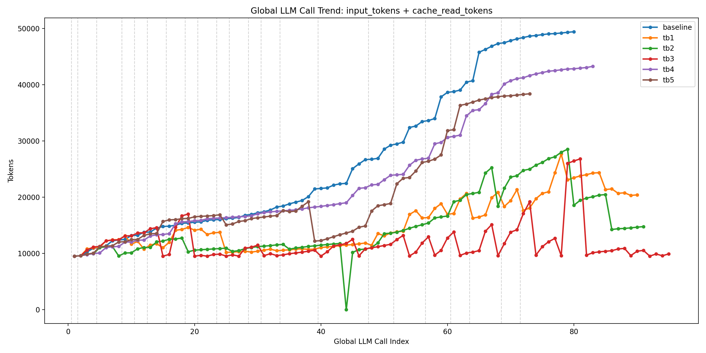

<h1 align="center">LightFlow: Lightweight and Efficient Continual Agents</h1>

<p align="center">
  Stable Prefix, Reduction, and Task-Aware Eviction for Long-Running Agent Sessions
</p>

<p align="center">
  
  
  
  
  
</p>

<p align="center">
  LightFlow is a runtime system for cache-efficient continual agents. It reduces token cost in long-running single-session agent workloads through stable-prefix rewriting, request-time reduction, and task-aware eviction.
</p>

---
LightFlow targets the failure mode that appears when an agent keeps solving tasks inside one long session:

- prompt history keeps growing
- already-finished tasks remain in context
- bulky tool outputs dominate later turns
- cache reuse becomes unstable when prompt structure drifts

The current LightFlow runtime focuses on three mechanisms:

- **Stable Prefix** for better upstream cache reuse
- **Reduction** for request-time local prompt slimming
- **Task-Aware Eviction** for removing cold completed tasks from canonical history

<span id='news'/>

## 📢 News

- **[2026-05-01]** LightFlow is released.

<span id='contents'/>

## 📑 Table of Contents

* <a href='#news'>📢 News</a>
* <a href='#why-ecoclaw'>🎯 Why LightFlow</a>
* <a href='#core-idea'>🧠 Core Idea</a>
* <a href='#installation'>🔧 Installation</a>
* <a href='#quickstart'>⚡ Quick Start</a>
* <a href='#architecture'>🏗️ Architecture</a>
* <a href='#repository-structure'>📁 Repository Structure</a>
* <a href='#experimental-results'>📊 Experimental Results</a>
* <a href='#bench'>🧪 Benchmark Repository</a>

<span id='why-ecoclaw'/>

## 🎯 Why LightFlow

Long-session agents are expensive for structural reasons, not just because tasks get harder over time.

The common failure pattern is:

1. useful context accumulates together with stale context
2. old completed tasks remain replayed in future prompts
3. large tool results contaminate the active prompt window
4. cache lineage becomes unstable when prompt prefixes drift across turns

LightFlow addresses this by treating history as a **task-aware, rewriteable runtime object**, not as a raw transcript that must be replayed forever.

<span id='core-idea'/>

## 🧠 Core Idea

LightFlow reduces token cost at three levels.

### 1. Stable Prefix
LightFlow rewrites the cacheable prefix so repeated requests share a more stable prompt prefix across turns.
This improves upstream cache reuse and reduces unnecessary prompt churn.

### 2. Reduction
LightFlow applies request-level local slimming to expensive prompt fragments such as:

- repeated reads
- oversized tool payloads
- HTML outputs
- exec outputs
- persisted tool results

This is local prompt hygiene rather than long-term memory compression.

### 3. Task-Aware Eviction
LightFlow maintains a canonical, task-aware history and tracks task lifecycle:

- `active`
- `completed`
- `evictable`

Old completed tasks are removed from canonical history once they become cold enough.
This is the main mechanism that prevents continual-session history from growing without bound.

<span id='features'/>

<span id='installation'/>

## 🔧 Installation

```bash
git clone <your-repo-url> ecoclaw && \
cd ecoclaw && \
pnpm install && \
pnpm build
```

To pack the OpenClaw plugin after building:

```bash
pnpm plugin:pack:release
```

<span id='quickstart'/>

## 🏗️ Architecture

The live architecture is best understood as two major phases.

### Phase 1: Pre-history processing

Before content becomes durable history, LightFlow can:

- stabilize prefix structure
- reduce bulky prompt content
- persist oversized tool results
- attach recovery metadata when needed

This phase is mostly implemented in:

- `packages/openclaw-plugin/src/proxy/`
- `packages/openclaw-plugin/src/tool-results/`
- `packages/openclaw-plugin/src/recovery/`

### Phase 2: Post-history lifecycle management

Once transcript content has been absorbed into canonical history, LightFlow can:

- derive task-aware history state
- update task registry
- mark tasks as `active`, `completed`, or `evictable`
- rewrite canonical history through task-level eviction

This phase is mostly implemented in:

- `packages/openclaw-plugin/src/transcript/`
- `packages/openclaw-plugin/src/canonical/`
- `packages/layers/history/`
- `packages/layers/decision/`

<span id='repository-structure'/>

## 📁 Repository Structure

### Live packages

- `packages/kernel/`
  - shared runtime types, events, and interfaces

- `packages/layers/history/`
  - raw semantic turns, task registry, and history-oriented state

- `packages/layers/decision/`
  - policy logic, task-state estimation, and eviction promotion

- `packages/openclaw-plugin/`
  - the runtime bridge into OpenClaw

### Important plugin-local modules

Inside `packages/openclaw-plugin/src/`, the runtime is split into focused modules:

- `proxy/`
  - request-time rewriting, stable-prefix, reduction, upstream forwarding

- `canonical/`
  - canonical history state, task anchors, task-level eviction

- `transcript/`
  - transcript-to-raw-semantic synchronization

- `execution/`
  - plugin-local reduction passes and archive-recovery helpers

- `recovery/`
  - memory-fault recovery protocol and recovery tool

- `tool-results/`
  - oversized tool-result persistence

- `runtime/`
  - plugin runtime orchestration

<span id='experimental-results'/>

## 📊 Experimental Results


### Continual Mode 

Continual mode evaluates LightFlow under a **multi-task single-session** workload: tasks run sequentially inside one shared session, accumulating prompt history over time. The baseline runs without any optimization. The Decoupled + FIFO variants enable eviction with different turn-batch sizes.

| Setting | Score | Total Tokens | Input Tokens | Cache Read Tokens |
| :-- | --: | --: | --: | --:|
| Baseline | 81.8 | 2,140,641 | 84,014 | 2,040,320 |
| Decoupled + FIFO, turnbatch=1 | 80.8 | 1,390,601 | 207,104 | 1,162,752 |
| Decoupled + FIFO, turnbatch=2 | 78.4 | 1,364,023 | 102,616 | 1,246,208 |
| Decoupled + FIFO, turnbatch=3 | 85.3 | 1,139,456 | 94,304 | 1,028,096 |
| Decoupled + FIFO, turnbatch=4 | 86.0 | 1,990,529 | 62,169 | 1,913,344 |
| Decoupled + FIFO, turnbatch=5 | 71.4 | 1,481,946 | 78,577 | 1,391,616 |

<div align="center">
  <picture>
    <source srcset="./figs/continual_mode_pinchbench.png" media="(prefers-color-scheme: dark)">
    
  </picture>
</div>

### Isolated Mode

Isolated mode evaluates LightFlow under **single-task isolated sessions**: each task runs in its own fresh session. LightFlow uses stable-prefix rewriting + reduction.

| Setting | Score | Total Tokens | Input Tokens | Cache Read Tokens |
| :-- | --: | --: | --: | --:|
| Baseline | 79.4 | 2,368,920 | 950,306 | 1,397,760 |
| Stability + Reduction | 86.2 | 1,502,254 | 124,363 | 1,355,264 |

<span id='bench'/>
